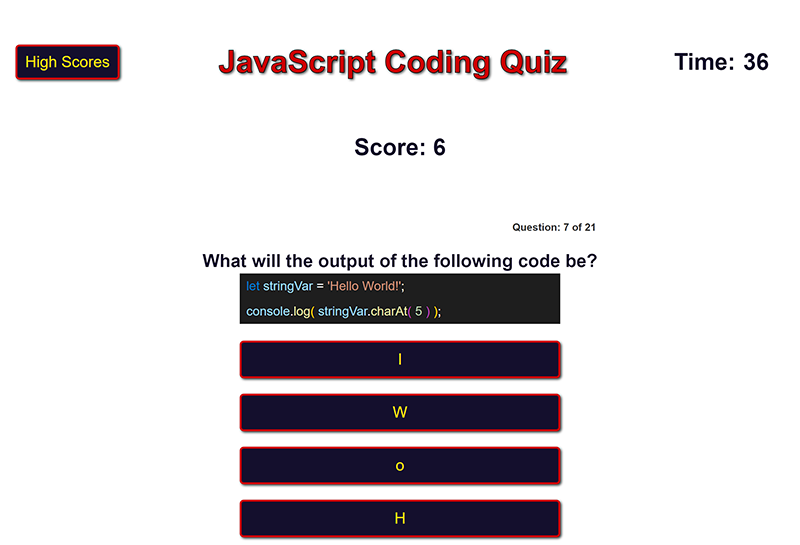

# JavaScript Quiz Game - 
## Deployed Application
[Click Here to Launch the Game](https://danielstewart914.github.io/quiz-game/)
## Description

### This is a fun knowledge quiz to see how much you know about JavaScript.
As part of my Full Stack Developer course I was tasked with creating a simple quiz using javaScript that interacts with the DOM to display questions along with a timer to limit the time you have to take the quiz.  

I try to give my projects some extra polish above and beyond the bare minimum, so for this project I added the following:
- Animations and color to the 'correct' or 'wrong' responses when you answer a question. 
- An animated '-5' for when you answer a question incorrectly.
- An animation on the end screen when adding the time remaining to your score.
- Formatting to code snippets within questions so that they match the formatting in VSCode.

## Table of Contents

- [Usage](#usage)
- [License](#license)
- [Technology](#technology)
- [Questions](#questions)

## Usage
- Click 'Start Quiz' to begin.
- Try and answer all questions as quickly as you can by clicking your chosen answer.
- Every correct answer earns you 1 point towards your final score.
- Every wrong answer will subtract 5 seconds off your time.
- If you finish before time runs out any remaining time will be added to your score as a bonus.
- Enter your initials in the field.
- Click 'Submit" to save your high score.

### Preview image

## License

MIT License

Copyright 2022 &copy; Daniel Stewart

Permission is hereby granted, free of charge, to any person obtaining a copy of this software and associated documentation files (the "Software"), to deal in the Software without restriction, including without limitation the rights to use, copy, modify, merge, publish, distribute, sublicense, and/or sell copies of the Software, and to permit persons to whom the Software is furnished to do so, subject to the following conditions:

The above copyright notice and this permission notice shall be included in all copies or substantial portions of the Software.

THE SOFTWARE IS PROVIDED "AS IS", WITHOUT WARRANTY OF ANY KIND, EXPRESS OR IMPLIED, INCLUDING BUT NOT LIMITED TO THE WARRANTIES OF MERCHANTABILITY, FITNESS FOR A PARTICULAR PURPOSE AND NONINFRINGEMENT. IN NO EVENT SHALL THE AUTHORS OR COPYRIGHT HOLDERS BE LIABLE FOR ANY CLAIM, DAMAGES OR OTHER LIABILITY, WHETHER IN AN ACTION OF CONTRACT, TORT OR OTHERWISE, ARISING FROM, OUT OF OR IN CONNECTION WITH THE SOFTWARE OR THE USE OR OTHER DEALINGS IN THE SOFTWARE.

## Technology

- 
- 
- 

## Questions 

Contact me through on of the links below  
[GitHub](https://github.com/danielstewart914) 
[Email](mailto:danielstewart914@outlook.com)
